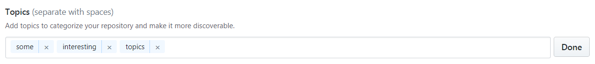

# starting

All major activies are currently happening here on Github.

## be(come) a [member](https://github.com/orgs/baloise/people)

### [sign up](https://github.com/signup/) for a free account at Github
Hint: if you already have an account please use it.

Hint: you do not necessarily have to use and thereby easily publish your work-eMail for this registration step.

But: to correctly differentiate the individual and corporate intellectual property please make sure to

#### 1. use your work-eMail within commits

and sign-offs that are performed within work hours and the corporate context.

Hint: You can easily use multiple [eMail-Identities](https://help.github.com/articles/adding-an-email-address-to-your-github-account/) within a single Github Account.

#### 2. keep your records up-to-date

as it can in some circumstance be "important" (e.g. when re-licensing content) being able to reach you

#### 3. avoid being too anonymous by using pseudonyms

if a project e.g. might get handed over to other legal entities at some point in the future, it's important (as in some cases impossible if not given) being able to differentiate who's participated within a project.

### add your username to the organization configuration
add your GitHub username to the *members* list [here](https://github.com/baloise/org/edit/master/config.yaml) and create a pull request for review. Please also state in the pull request that you've read and understood our [Open Source Guidelines](https://baloise.github.io/open-source/docs/arc42/) and agree to act accordingly. After your request was approved an merged you'll receive an invitation link.

### think about adjusting your [notification settings](https://github.com/settings/notifications)

### if interested: [make your membership public](https://help.github.com/articles/publicizing-or-hiding-organization-membership/) on [our team page](https://github.com/orgs/baloise/people)

## (our) [contribute](https://baloise.github.io/open-source/docs/arc42/#_contributing_to_open_source) guidelines

## (our) templates

### [repository-template-java](https://github.com/baloise/repository-template-java)

### [repository-template-nosrc](https://github.com/baloise/repository-template-nosrc)

## define topics

add topics to categorize your repository and make it more discoverable.

